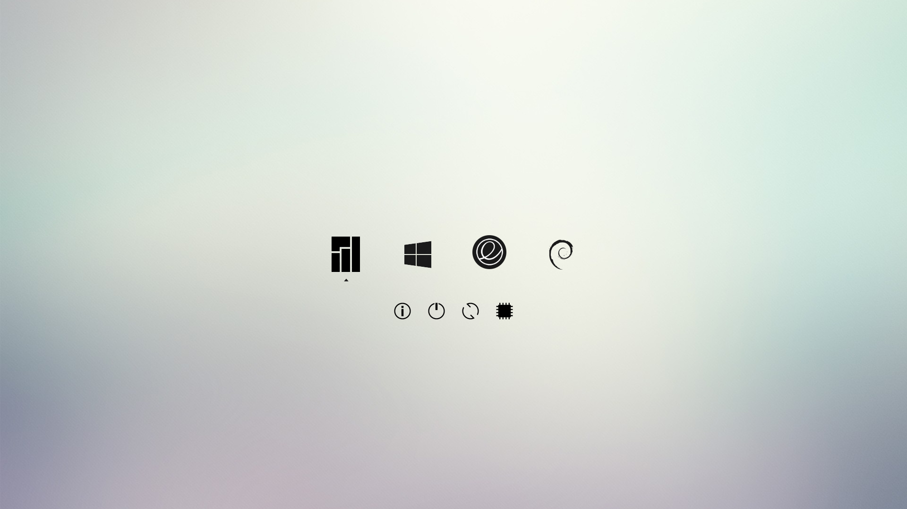
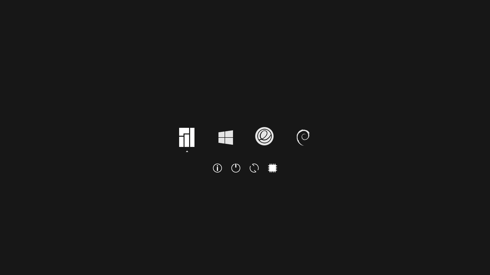
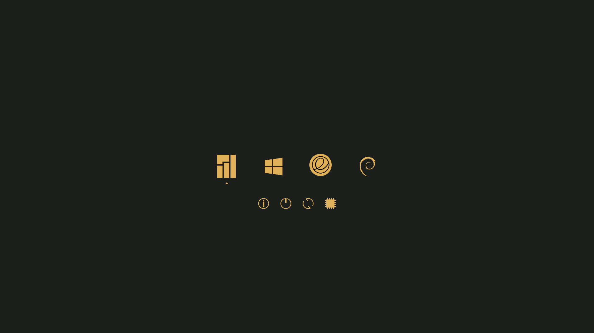

## Minimalist rEFInd Themes

[rEFInd](http://www.rodsbooks.com/refind/) is a boot manager for UEFI based systems. These are 4 clean and minimal themes for it.

This version is based on the 2013 theme by [Evan Purkhiser][evan] with some modifications and additional dark theme, nord theme, and gruvbox theme.

##### Light Theme

##### Dark Theme

##### Nord Theme

##### Gruvbox Theme


### Usage

 1. Install rEFInd and locate your refind EFI directory. This is commonly `/boot/EFI/refind`
    though it will depend on where you mount your ESP and where rEFInd is installed. 
    `fdisk -l` and `mount` may help.

 2. Create a folder called `themes` inside it, if it doesn't already exist.

 3. Clone this repository into the `themes` directory.

 4. To enable the theme add `include themes/rEFInd-minimal-themes/<your-theme-style>/theme.conf` at the end of `refind.conf`. 
 For example, `include themes/rEFInd-minimal-themes/rEFInd-minimal-light/theme.conf`
 Or just copy 3 folders and use a shorter directory line.
5. Uncomment `scanfor external,manual` in `refind.conf`.

Here's an example menuentry configuration (from the screenshot):

```nginx
menuentry "Manjaro Linux" {
    icon /EFI/refind/themes/rEFInd-minimal-light/icons_light/os_manjaro.png
    volume 84D8A95B-8A17-4C49-A29D-30DBBE068056
    loader /boot/vmlinuz-4.19-x86_64
    initrd /boot/initramfs-4.19-x86_64.img
    options "root=UUID=523ea1d9-0cd0-4760-8941-db06da1a4aa6 rw  quiet resume=UUID=7d906c0e-5230-43ef-8aeb-f42b99e29041 initrd=/boot/amd-ucode.img"
    submenuentry "Use fallback initramfs" {
        initrd /boot/initramfs-4.19-x86_64-fallback.img
    }
}

menuentry "Windows 10 Pro" {
    icon \EFI\refind\themes\rEFInd-minimal-light\icons_light\os_win10.png
    loader \EFI\Microsoft\Boot\bootmgfw.efi
}

menuentry "elementary OS" {
    icon /EFI/refind/themes/rEFInd-minimal-light/icons_light/os_elementary.png
    volume 94133D0F-12BC-4D73-8952-B314CB30479D
    loader /boot/vmlinuz-4.15.0-55-generic
    initrd /boot/initrd.img-4.15.0-55-generic
    options "root=UUID=7e1ac44f-c126-4380-b90e-1f420c95f05c ro quiet splash $vt_handoff"
}

menuentry "Debian Linux" {
    icon /EFI/refind/themes/rEFInd-minimal-light/icons_light/os_debian.png
    volume E605741D-0015-4471-9711-803066C4455A
    loader /boot/vmlinuz-4.19.0-0.bpo.1-amd64
    initrd /boot/initrd.img-4.19.0-0.bpo.1-amd64
    options "root=UUID=edc276be-fcf5-443f-83fa-eb8f5e15af55 ro quiet nomodeset"
}
```

Entries that are autodetected should also show the proper icons.
* For the `volume` token, use the partition label that contain the OS.
If this label isn't unique, use `blkid` command to get the PARTUUID (GUID) of that partition.
* For other tokens, just modify as match as `/boot/grub/grub.cfg`.
* Remember to config `theme.cfg` again after a system kernel upgrade.

Read more about rEFInd configuration at [this link][refind-config]

### Background sizes

If you find the background looks blurry it may be due to the included wallpaper being an incorrect resolution for your monitor. You can download the [original high quality wallpaper][wallpaper], resize it as appropriate, and replace the `background_<style>.png`.

You can of course also choose your own background!

### Attribution

The OS icons are from [Lightness for burg][icons] by [SWOriginal][icon-author].
The OS icons color of dark theme and gruvbox theme was colorized by me.

The light background is [Minimalist Wallpaper][wallpaper] by [LeonardoAIanB][wallpaper-author]. Thank you to [Padster][padster] for locating it!

[evan]: https://github.com/EvanPurkhiser/rEFInd-minimal
[icons]: http://sworiginal.deviantart.com/art/Lightness-for-burg-181461810
[icon-author]: http://sworiginal.deviantart.com/

[padster]: https://github.com/theRealPadster
[wallpaper]: http://leonardoalanb.deviantart.com/art/Minimalist-wallpaper-295519786
[wallpaper-author]: http://leonardoalanb.deviantart.com/
[refind-config]: https://www.rodsbooks.com/refind/configfile.html

